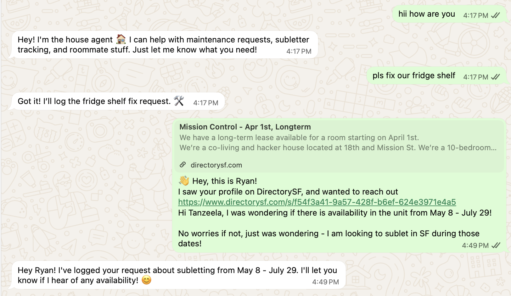

# house-agent

A WhatsApp agent for roommates to manage shared house tasks: maintenance requests and subletter tracking.



## How it works

1. **Roommate sends a WhatsApp message** — "pls fix our fridge shelf", "I'm looking to sublet May–July", etc.
2. **Typesafe classifies the intent** — maintenance request, potential subletter, roommate inquiry — with confidence scores and urgency detection, in a single API call
3. **Action router branches on the results** — high confidence triggers auto-actions (log to DB, append to Google Sheet); low confidence asks for clarification
4. **OpenAI generates a reply** — short, casual WhatsApp-style acknowledgment sent back via Twilio

## Tech stack

| Component | Technology | Role |
|---|---|---|
| Messaging | **Twilio** WhatsApp API | Receive and send WhatsApp messages |
| Classification | **Typesafe** | Intent detection + urgency scoring (structured, confidence-scored) |
| Response generation | **OpenAI** (GPT-4o-mini) | Compose natural language replies + extract structured details |
| Subletter tracking | **Google Sheets** API | Auto-append candidates to shared spreadsheet |
| Server | **FastAPI** + Uvicorn | Webhook endpoint |
| Database | **SQLite** | Roommates, messages, and request history |
| Deployment | **Fly.io** | Prod hosting with persistent volumes |

## Setup

```bash
python3 -m venv .venv
source .venv/bin/activate
pip install -r requirements.txt
```

Copy `.env.example` to `.env` and fill in your keys:

```bash
cp .env.example .env
```

### Google Sheets (subletter tracking)

The agent automatically adds subletter/roommate candidates to a Google Sheet when they're mentioned in WhatsApp messages.

1. Create a Google Cloud service account with the Sheets API enabled
2. Download the JSON key and save it as `service_account.json` in the project root
3. Share the Google Sheet with the service account's `client_email` (Editor access)

## Running

**Terminal 1** — start the server:

```bash
source .venv/bin/activate
uvicorn app:app --reload --port 8000
```

**Terminal 2** — expose via ngrok:

```bash
ngrok http 8000
```

Then set the ngrok URL as your Twilio WhatsApp Sandbox webhook at:
https://console.twilio.com/us1/develop/sms/try-it-out/whatsapp-learn

Set "When a message comes in" to:

```
https://<your-ngrok-url>.ngrok-free.app/webhook
```

Method: POST

## Joining the Agent (Sandbox)

We're currently using the Twilio WhatsApp Sandbox. Each roommate must opt in before they can message the agent:

1. Save the sandbox number (see `.env` → `TWILIO_WHATSAPP_NUMBER`) as a contact
2. Send `join her-so` to that contact on WhatsApp
3. Wait for the confirmation message

This must be repeated every 72 hours (sandbox limitation). Once we have an approved WhatsApp Business number, this step goes away.

## Deploying to Fly.io

### First-time setup

1. Install the Fly CLI and log in:

```bash
brew install flyctl
fly auth login
```

2. Launch the app (uses existing `fly.toml`):

```bash
fly launch --no-deploy
```

3. Create a persistent volume for SQLite:

```bash
fly volumes create house_agent_data --region sjc --size 1
```

4. Set your secrets:

```bash
fly secrets set \
  TYPESAFE_API_KEY="your-key" \
  OPENAI_API_KEY="your-key" \
  ANTHROPIC_API_KEY="your-key" \
  TWILIO_ACCOUNT_SID="your-sid" \
  TWILIO_AUTH_TOKEN="your-token" \
  TWILIO_WHATSAPP_NUMBER="whatsapp:+1XXXXXXXXXX"
```

5. Deploy:

```bash
fly deploy
```

### Redeploying after changes

```bash
fly deploy
```

### Useful commands

```bash
fly logs              # view live logs
fly ssh console       # SSH into the running machine
fly status            # check app status
```

Once deployed, update the Twilio webhook to:

```
https://house-agent-morning-water-9712.fly.dev/webhook
```

## What we learned

This started as a lightweight conversational assistant for managing shared house workflows. The deeper we got, the more it surfaced distributed systems and orchestration problems emerging in a new interface paradigm.

**AI agents in an AI agent world.** The world is moving towards human → AI → AI → System. Our maintenance request portal now uses a chatbot, so our agent needs to communicate with that AI too. More services means more points of failure — it's like hiring a lawyer who has to negotiate with another lawyer.

**Bounding ambiguity, not hallucinations.** Typesafe's bet is to lean towards a yes/no instead of a hallucination — "traditional AI" confidence thresholds applied to an agentic workflow. When the agent isn't sure if a message is a maintenance request, it should say so, not guess.

**Race conditions in multi-agent systems.** What if two people ask to update the sublet tracker at the same time? How do we not break the Google Sheet? Should we think about atomicity and race conditions differently in an agent world?

**Team representation and shared memory.** What if someone has already asked this question? How do you aggregate data and context for a team using a shared agent?

**Delegation and permissions.** How do you give an agent limited permissions? It can file maintenance requests but shouldn't be able to sign a lease.

**Better UIs for conversational agents.** Twilio is difficult to work with and WhatsApp is limiting. There are likely better interface options for agent-first experiences.

## Task List

### V0 — Core Agent
- [x] FastAPI webhook server (receives WhatsApp messages via Twilio)
- [x] Twilio WhatsApp Sandbox connected
- [x] Typesafe intent classification (maintenance, roommates, subletters, etc.)
- [x] Typesafe urgency detection (is_urgent noul)
- [x] SQLite database (roommates, messages, requests)
- [x] OpenAI response generation
- [x] Test with multiple people messaging the agent
- [x] Action router (branch on Typesafe results + confidence)

### Backlog
- [x] Deploy to Fly.io with persistent volume for SQLite
- [ ] Approved WhatsApp Business number for prod (points to fly.dev URL, removes join step)

### Environment setup
- **Dev**: Twilio sandbox → ngrok → local machine
- **Prod**: Approved WhatsApp Business number → house-agent-morning-water-9712.fly.dev/webhook → Fly.io

### V1 — Automation
- [ ] OpenClaw browser automation for maintenance portal
  - [x] `maintenance.py` module + wired into action router
  - [ ] `nvm use 22 && npm install -g openclaw@latest`
  - [ ] `openclaw onboard --install-daemon` (use Anthropic API key)
  - [ ] `openclaw browser` → manually log into AppFolio once
  - [ ] Test end-to-end: WhatsApp message → maintenance request submitted via portal chatbot
- [ ] Confidence-gated safety for real-world actions
- [x] Google Sheets integration (subletter tracking)
- [ ] LLM fallback for classification when Typesafe is down
- [ ] Switch response generation to Gemini (free tier)
